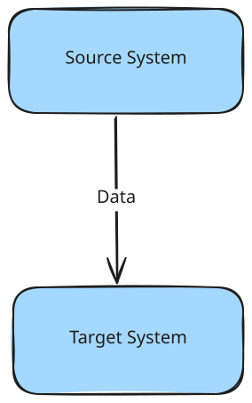
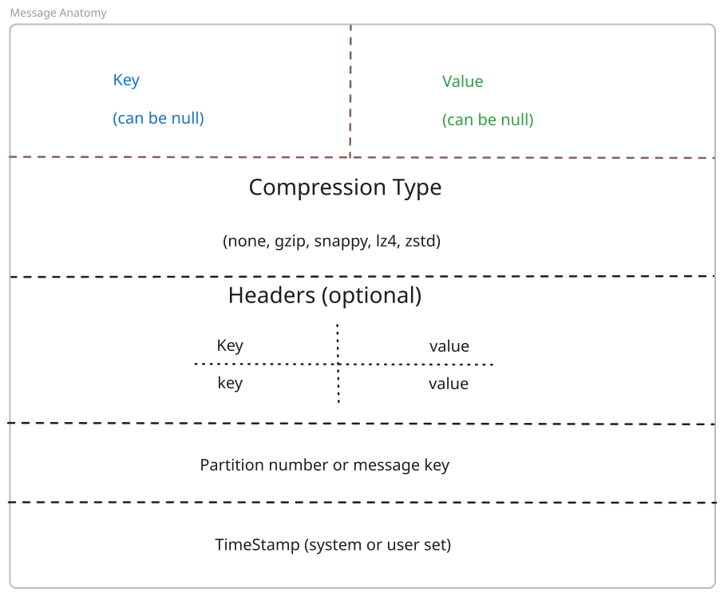
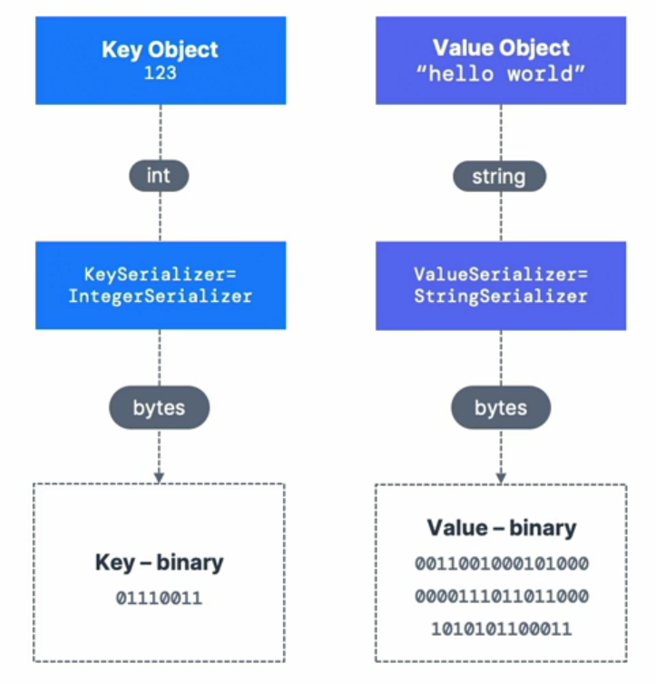
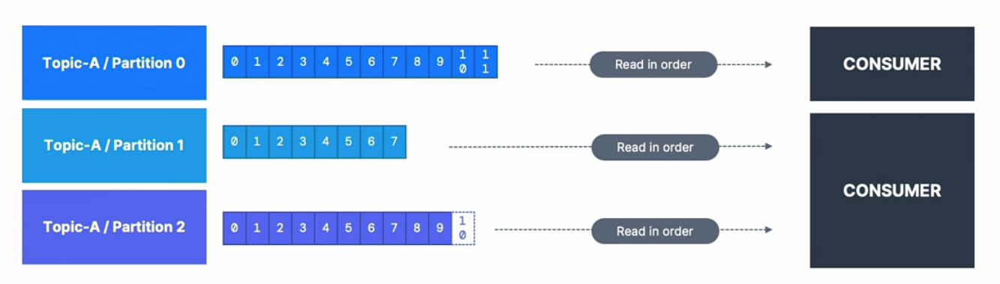
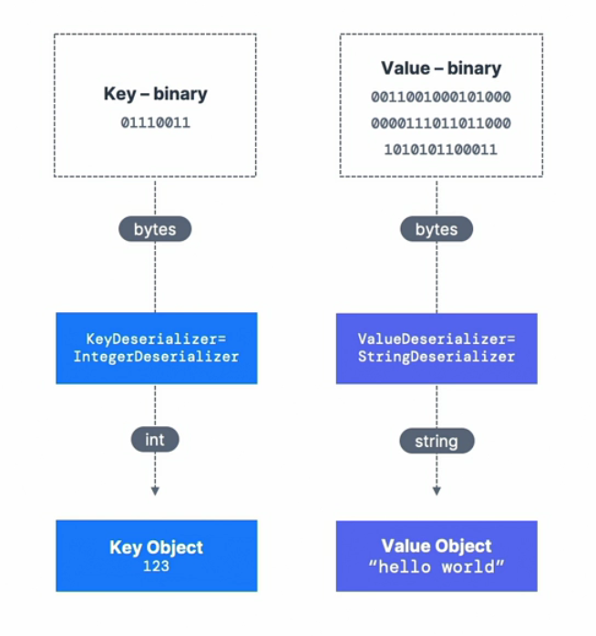
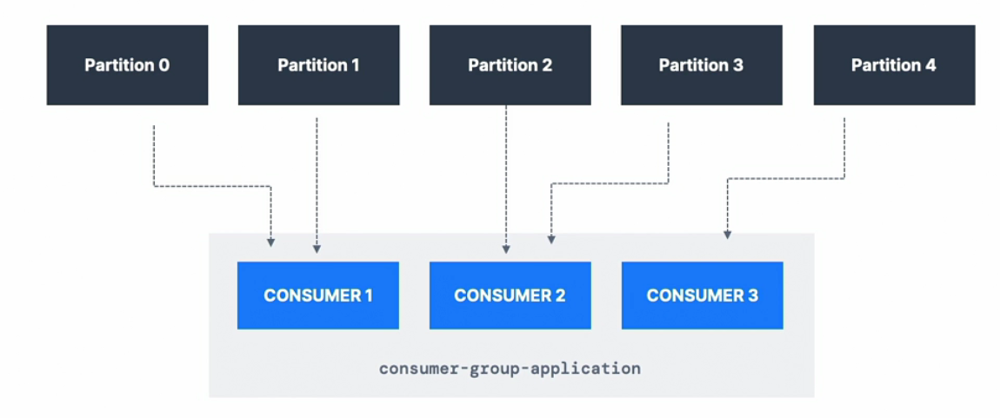
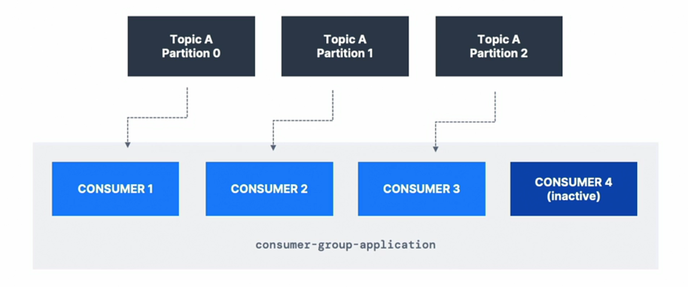
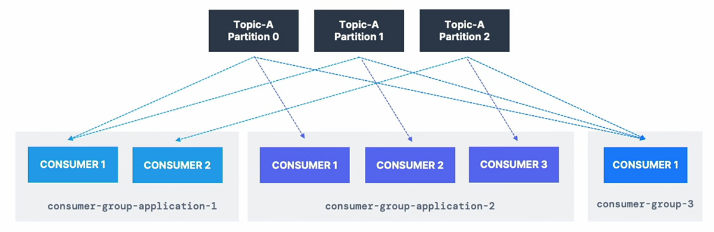
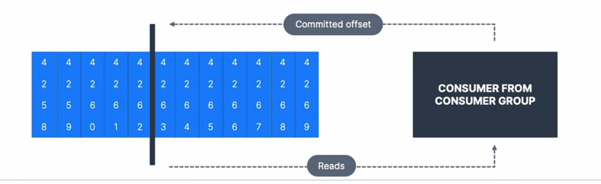

# **Fundamentals of Apache Kafka**

---

## **Data Integration**


---

## **Data Integration**
* Extract the data, transform it and Load it to the target system
* Simple at first

---

## **Data Integration Evolution**


---
## **Data Integration Evolution**
* If you have `4 source systems` and `6 target systems`, you need to write `24 integrations`
* Cherry on Top
  * Each Integration comes with diffulties around
    * Protocol - how the data is transported (TCP, HTTP, GRPC, FTP, JDBC)
    * Data format - how the data is parsed (Binary, CSV, JSON, Avro, Protobuf)

---

## **Data Integration**


---

## **Data Integration**


---

## **Kafka**
> Kafka is a `distributed`, `fault tolerant`, `horizontly Scalable`, pub-sub event streaming platform designed for handling real-time data feeds, Created by LinkedIn, Open Sourced under Apache License 2.0, Maintained by Confluent, IBM, Cloudera and LinkedIn

---
## **Why Kafka**
* Can scale to 100s of brokers
* Can scale to millions of messages per second
* High performance (latency of less than 10ms) - real time
* Used has a huge community support and used by large tech organizations around the world
* Integration with Spark, Flink, Storm, Hadoop, and other Big Data technologies
* De-coupling of system dependencies
* Application Logs gathering

---
## **Agenda**
* Kafka Cluster
* Kafka Broker
* Producers and Source Systems
* Consumers and Target Systems
* Kafka Management (ZooKeeper or KRaft Mode)

---
## **Agenda**


---
## **Agenda**
* Kafka Connect
* Kafka Stream API
* KsqlDB
* Confluent Schema Registry (Confluent Components)
* Kafka Architecture in the enterprise
* Real world use cases
* Advanced API + Configurations
* Topic Configurations

---

## **Agenda** (Opeations Perspective)
* Kafka Security
* Kafka Monitoring and Operations
* Kafka Cluster Setup and Administration
---

## **Kafka Topics**
* In a Kafka Cluster, a topic is a particular stream of data
* You can have as many topics as you want
* A topic is identified by it's *name*
* Any kind of message format (JSON, Avro, binary etc)
* The sequence of messages in a topic is called a data streams
* There are no querying capabilities on topics, instead you can consume the stream of data

---

## **Topics, Partitions and offsets**
* Topics are split in partitions (example: 100 partitions)
* Messages within each partition are ordered
* Each message within a partition gets an incremental id, called `offset`
* Kafka topics are immutable (Once data is written to a partition, it cannot be changed)

---
## **Topics, Partitions and offsets**


---
## **Topics, Partitions and offsets**
* Data is kept only for a limited time (default is one week - configurable)
* Offset only have a meaning for a specific partition
  * E.g. offset 3 in partition 0 doesn't represent the same data as offset 3 in partition 1
  * Offsets are not re-used even if previous messages have been deleted
* Order is guaranteed only within a partition (not across partitions)
* Data is assigned randomly to a partition unless a key is provided (will see this later)
* You can have as many partitions per topic as you want

---

## **Producers**
* Producers write data to topics
  * Which are made of partitions
* Producers know to which partition to write to (and which kafka broker has it)
* In case of Kafka broker failures, Producers will automatically recover

---
## **Producers: Message Keys**
* Producers can choose to send a `key` with a message (string, number, binary, etc)
* If the `key = null`, the data is send to partitions in round robin fashion
* If `key != null`, then all messages for that key will always go to the same partition (hashing)
* A key is typically sent, if you need message ordering for a specific field (ex: ride_id)
---
## **Producers: Message Keys**


---
## **Kafka Messages anatomy**




---
## **Kafka Messages Serializer**

* Kafka only accepts bytes as an input from producers and sends bytes out as an output to consumers
* Serializer are specified for the value and the key
* Common Serializers
  - String (incl. JSON)
  - Int, Float
  - Avro
  - Protobuf

---

## **Kafka Messages Serializer**



---
## **Kafka Message Key Hashing**

- Responsibility of `Kafka Partitioner` to decide the partition for a message

-  If the key is specified for a message, the hashing is done using `murmur2` algorithm
```java

targetPartition = Math.abs(Utils.murmur2(keyBytes)) % numberOfPartitions

```
---

## **Consumers**
* Consumers read data from a topic (identified by name) - pull model
* Data is read in order from low to high offset **within each partitions**
* There are no ordering guaranteed across partition
* You don't specify the broker when consuming messages

---
## **Consumers**



---

## **Consumer Deserializer**
* Deserializer indicates how to transform bytes into objects
* Deserializer is used on the key and value of the event
* Common Deserializers
  - String
  - Int, Float
  - Avro
  - Protobuf
* The Serialization / Deserialization type must not change during a topic lifecycle
  * Create a new topic instead

---
## **Consumer Deserializer**



---

## **Consumer Groups**

* All the consumers in an application read data as a consumer groups
* Each partition is assigned to exactly one consumer within a group
* One consumer can read from multiple partitions
* But one partition cannot be read by multiple consumers in the same group

---
## **Consumer Groups**



---

## **Consumer Groups - What if too many consumers?**
* Having more consumers than partitions means some consumers will be idle

---

## **Consumer Groups - What if too many consumers?**



---

## **Multiple Consumers on One topic**

* In Apache Kafka, it is acceptable to have multiple consumer groups on the same topic




---

## **Consumer Offsets**

* Kafka Stores the offsets at which a consumer group has been reading
* The offsets committed are in Kafka topic named __consumer_offsets
* When the consumer in a group has processed data received from Kafka, it should periodically committing the offsets 
* It is like telling to the broker, how far have we successfully read
* If a consumer dies, it will be able to read back from where it left off thanks to the committed consumer offsets!

---

## **Consumer Offsets**


---

## **Delivery Semantics for Consumers**
* By default, Java Consumers will automatically commit offsets (at least once)
* There are 3 delivery semantics if you choose to commit manually
* At least once (Usually Preferred)
  * Offsets are committed after the message is read
  * If the processing goes wrong, the message will be read again
  * This might result in duplicate processing of messages. Make sure your processing is Idempotent (i.e processing again the messages won't impact your system)

---
## **Delivery Semantics for Consumers**

* At most once
  * Offset are committed as soon as messages are received
  * If the processing goes wrong, some messages will be lost (they won't be read again)

---

## **Delivery Semantics for Consumers**

* Exactly Once
* Messages are processed exactly one time, even in the event of retries or failure
* Useful for critical processing, like a financial transaction
* Scenerio:
  * Message 1: Transfer $100 from Account A to Account B.
  * Message 2: Deduct $50 from Account C for a purchase.

---

## **Delivery Semantics for Consumers (Exactly Once)**


* What Could Go Wrong Without Exactly-Once:
  * Duplicate Processing (At-Least-Once):

    * The consumer reads Message 1 and updates the database but fails to commit the offset due to a crash. After restarting, it      reprocesses Message 1 and updates the balances again. Result: Account A is debited $200 instead of $100, and Account B is credited $200.
    
  * Missed Processing (At-Most-Once):
    * The consumer reads Message 2 and commits the offset before updating the database. If the consumer crashes before updating, Message 2 is skipped when it restarts. Result: Account C is not debited, leading to an incorrect balance.

---
## **How Kafka's Exactly-Once Semantics Helps**

* Atomic Writes and Offset Commits:
  * Kafka’s transactional API ensures that updating the account balance in the database and committing the offset happen as a single atomic operation.
  If the operation succeeds, both the balance update and the offset commit are completed. If it fails, neither is applied.

* Idempotent Updates
  * Kafka guarantees no duplicate messages are produced. On the consumer side, you ensure the database updates are idempotent (e.g., by checking if a transaction ID has already been processed).

---
## **Another Pattern for Exactly Once**

```java
  Read → Process → Write Pattern:

  Consumer reads from Topic A
  ↓
  Process data
  ↓
  Producer writes to Topic B
  (All in one transaction)
```

---
