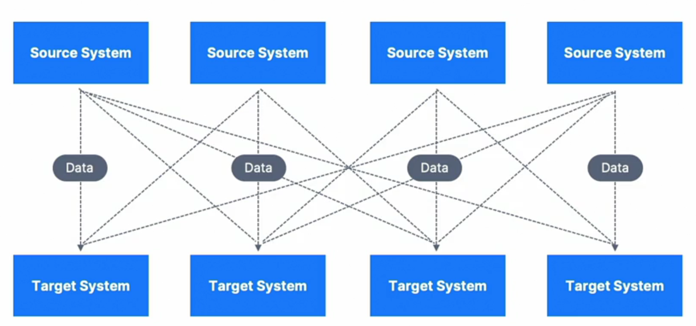
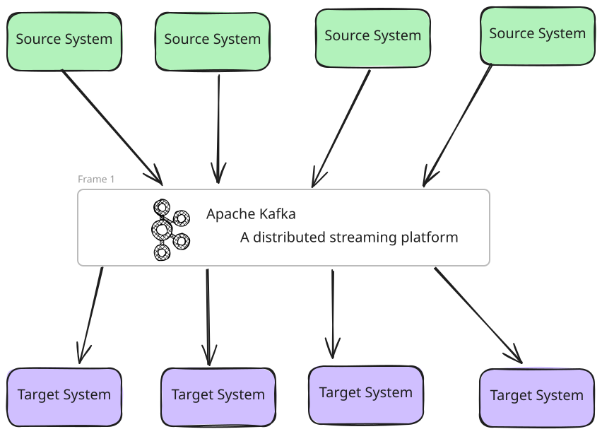
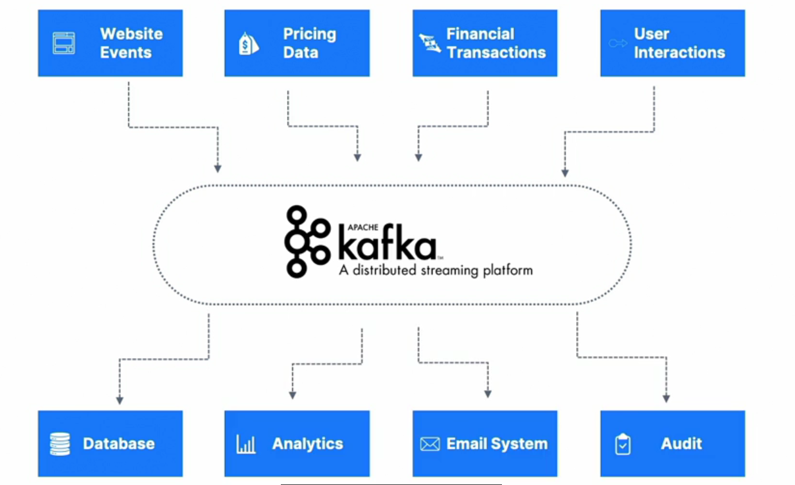
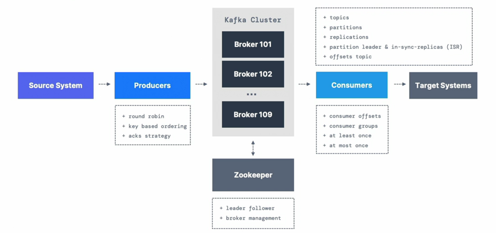
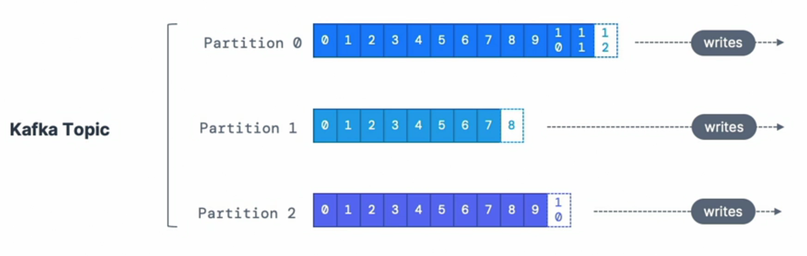
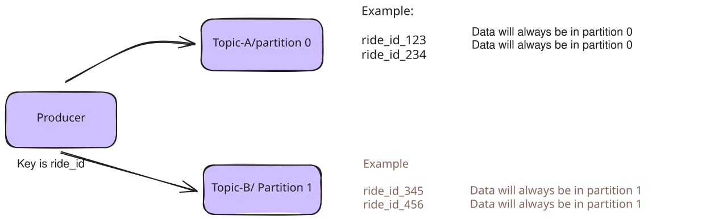

# **Fundamentals of Apache Kafka**

---

## **Data Integration**


---

## **Data Integration**
* Extract the data, transform it and Load it to the target system
* Simple at first

---

## **Data Integration Evolution**


---
## **Data Integration Evolution**
* If you have `4 source systems` and `6 target systems`, you need to write `24 integrations`
* Cherry on Top
  * Each Integration comes with diffulties around
    * Protocol - how the data is transported (TCP, HTTP, GRPC, FTP, JDBC)
    * Data format - how the data is parsed (Binary, CSV, JSON, Avro, Protobuf)

---

## **Data Integration**



---

## **Data Integration**


---

## **Kafka**
> Kafka is a `distributed`, `fault tolerant`, `horizontly Scalable`, pub-sub event streaming platform designed for handling real-time data feeds, Created by LinkedIn, Open Sourced under Apache License 2.0, Maintained by Confluent, IBM, Cloudera and LinkedIn

---
## **Why Kafka**
* Can scale to 100s of brokers
* Can scale to millions of messages per second
* High performance (latency of less than 10ms) - real time
* Used has a huge community support and used by large tech organizations around the world
* Integration with Spark, Flink, Storm, Hadoop, and other Big Data technologies
* De-coupling of system dependencies
* Application Logs gathering

---
## **Agenda**
* Kafka Cluster
* Kafka Broker
* Producers and Source Systems
* Consumers and Target Systems
* Kafka Management (ZooKeeper or KRaft Mode)

---
## **Agenda**


---
## **Agenda**
* Kafka Connect
* Kafka Stream API
* KsqlDB
* Confluent Schema Registry (Confluent Components)
* Kafka Architecture in the enterprise
* Real world use cases
* Advanced API + Configurations
* Topic Configurations

---

## **Agenda** (Opeations Perspective)
* Kafka Security
* Kafka Monitoring and Operations
* Kafka Cluster Setup and Administration
---

## **Kafka Topics**
* In a Kafka Cluster, a topic is a particular stream of data
* You can have as many topics as you want
* A topic is identified by it's *name*
* Any kind of message format (JSON, Avro, binary etc)
* The sequence of messages in a topic is called a data streams
* There are no querying capabilities on topics, instead you can consume the stream of data

---

## **Topics, Partitions and offsets**
* Topics are split in partitions (example: 100 partitions)
* Messages within each partition are ordered
* Each message within a partition gets an incremental id, called `offset`
* Kafka topics are immutable (Once data is written to a partition, it cannot be changed)

---
## **Topics, Partitions and offsets**


---
## **Topics, Partitions and offsets**
* Data is kept only for a limited time (default is one week - configurable)
* Offset only have a meaning for a specific partition
  * E.g. offset 3 in partition 0 doesn't represent the same data as offset 3 in partition 1
  * Offsets are not re-used even if previous messages have been deleted
* Order is guaranteed only within a partition (not across partitions)
* Data is assigned randomly to a partition unless a key is provided (will see this later)
* You can have as many partitions per topic as you want

---

## **Producers**
* Producers write data to topics
  * Which are made of partitions
* Producers know to which partition to write to (and which kafka broker has it)
* In case of Kafka broker failures, Producers will automatically recover

---
## **Producers: Message Keys**
* Producers can choose to send a `key` with a message (string, number, binary, etc)
* If the `key = null`, the data is send to partitions in round robin fashion
* If `key != null`, then all messages for that key will always go to the same partition (hashing)
* A key is typically sent, if you need message ordering for a specific field (ex: ride_id)
---
## **Producers: Message Keys**



---
## **Kafka Messages anatomy**


---
## **Kafka Messages Serializer**

* Kafka only accepts bytes as an input from producers and sends bytes out as an output to consumers
* Serializer are specified for the value and the key
* Common Serializers
  - String (incl. JSON)
  - Int, Float
  - Avro
  - Protobuf

---

## **Kafka Messages Serializer**


---
## **Kafka Message Key Hashing**

- Responsibility of `Kafka Partitioner` to decide the partition for a message

-  If the key is specified for a message, the hashing is done using `murmur2` algorithm
```java

targetPartition = Math.abs(Utils.murmur2(keyBytes)) % numberOfPartitions

```
